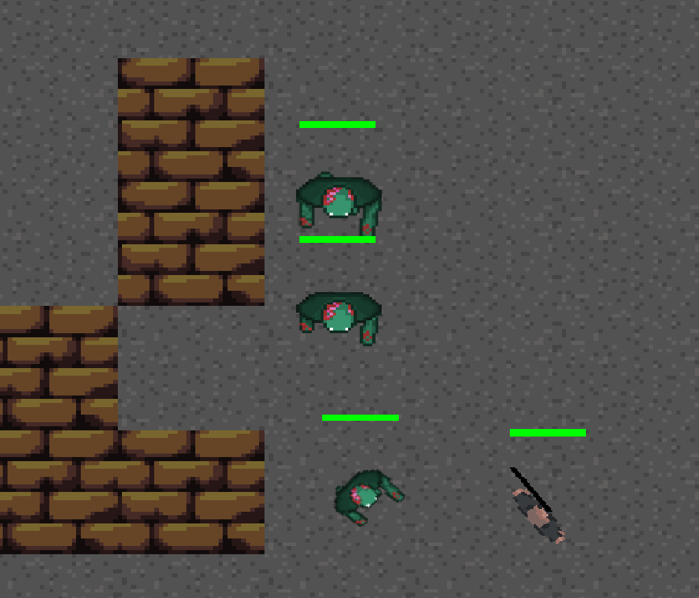

# 🧟 ZOMBOS - Pygame Zombi Hayatta Kalma Oyunu

Zombos, Python ve Pygame kullanılarak geliştirilmiş bir 2D hayatta kalma oyunudur. Oyuncu, çeşitli zombi türlerine karşı dalga dalga savaşarak mümkün olduğunca uzun süre hayatta kalmaya çalışır. Bu oyun, Programlama Dilleri Laboratuvarı dersi kapsamında geliştirilmiş bir projedir.

## 🎮 Oynanış

- Oyuncu bir karakteri yönlendirerek zombilerle savaşır.
- Her dalga, daha zorlu ve daha hızlı zombilerle birlikte gelir.
- Oyunda 3 farklı zombi türü bulunmaktadır:
  - **Normal Zombi**: Kolayca öldürülebilir ama sayıca fazladır.
  - **Hızlı Zombi**: Hızlı hareket eder, yakalanması ve kaçılması zordur.
  - **Tank Zombi**: Yavaş ama dayanıklıdır, daha fazla hasar verir.

## ⌨️ Kontroller

- `W`, `A`, `S`, `D`: Hareket  
- `Mouse`: Nişan alma ve ateş etme  
- `ESC`: Oyunu duraklat  
- `1`, `2`, `3`: Pistol, Shotgun, Minigun  

## 🛠️ Kurulum

1. Python 3.x yüklü olduğundan emin olun.  

```bash
git clone https://github.com/FantaJr/Zombos.git 
cd Zombos
pip install -r requirements.txt
python3 main.py
```
## 📷 Oyun İçi Görüntü



## 👤 Öğrenci Bilgileri

- **Ad Soyad**: Gökay Gökcan  
- **Öğrenci No**: 23253039  
- **Ders**: Programlama Dilleri Laboratuvarı  
